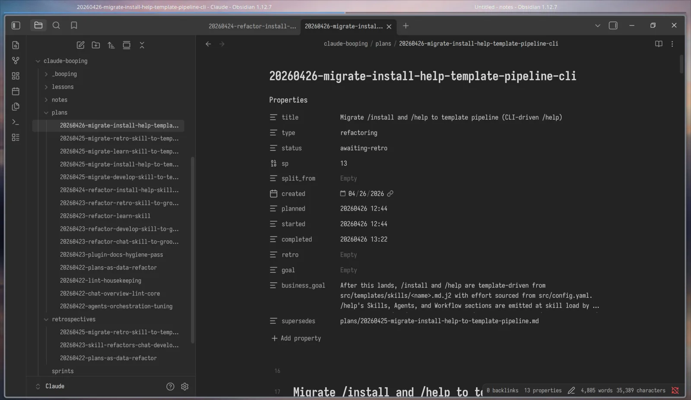

# booping

A self-learning, project-scoped sprint workflow for Claude Code. booping turns a feature idea into a durable, on-disk loop — **groom → develop → retro → learn** — that effectively utilizes sub-agents to avoid context rot and cross-validates each plan against Gemini before development begins. Every artifact (plans, retros, lessons, sprint snapshots) lives under `~/Claude/{project}/`, one folder per codebase, so weeks-long programs stay legible long after the session ends.



*Each project's vault is a plain Obsidian-friendly folder of markdown files.*

## Obsidian-ready by design

The vault at `~/Claude/{project}/` is markdown-only with YAML frontmatter that Obsidian renders natively as Properties. One vault per project, side-by-side with whatever else you keep in `~/Claude/`. No proprietary database, no lock-in — just files you can grep, version, and edit by hand.

## Dependencies

Required: `uv` and `git`. Optional: `GEMINI_API_KEY` environment variable for `/groom` cross-validation against Gemini.

```bash
# macOS
brew install uv git

# Linux (Debian/Ubuntu)
sudo apt install -y git
curl -LsSf https://astral.sh/uv/install.sh | sh
```

## Installation

### Development (fastest)

```bash
claude --plugin-dir /path/to/claude-booping/
```

Loads the plugin into the current session only.

### Via Claude Code marketplace (persistent)

```
/plugin marketplace add /path/to/claude-booping/
/plugin install booping@booping-local
```

The plugin ships with a `.claude-plugin/marketplace.json` so the second command works.

### From GitHub

```
/plugin marketplace add A/claude-booping
/plugin install booping@booping-local
```

After installing, `cd` into the target repo and run `/install`. That single step scaffolds `~/Claude/{project}/` (with `plans/`, `retrospectives/`, `lessons/`, `notes/`, `_booping/`).

## Quick start

The full loop is five commands. Run them in order:

```bash
# Inside the target repo, once:
/install

# Spec a feature, bug, or refactor — free-text description.
# The more detailed your brief, the sharper the resulting plan:
/groom Add per-tenant rate limiting to the public API

# Execute the next ready plan (auto-claims from the queue):
/develop
# …or target a specific one (path relative to ~/Claude/{project}/):
/develop plans/20260426-per-tenant-rate-limiting.md

# Retrospect on what shipped:
/retro plans/20260426-per-tenant-rate-limiting.md

# Fold the retro's findings into durable rules:
/learn retrospectives/20260426-per-tenant-rate-limiting.md
```

The skills will list candidates if you forget the exact filename.

## Workflow

A plan moves through a small set of statuses. `/groom` shapes the spec and waits for explicit user approval before handing off; `/develop` claims the next ready plan and executes milestone by milestone; `/retro` compares what shipped to the original spec; `/learn` distils the retrospective into rules that bind the next sprint.

The status vocabulary below is the canonical set in `src/config.yaml` `plan.statuses`:

```text
/groom    backlog → in-spec → awaiting-plan-review → ready-for-dev
          (loopback: awaiting-plan-review → in-spec)
          (parking: in-spec → backlog)
          (cancellation: backlog/in-spec/awaiting-plan-review → cancelled)

/develop  ready-for-dev → in-progress → awaiting-retro
          (failure: in-progress → fail)

/retro    awaiting-retro → awaiting-learning
          (skip: awaiting-retro → done)

/learn    awaiting-learning → done

Terminal states: cancelled · done · fail
```

## Statuses

A plan carries one of the following statuses in its frontmatter. Terminal states are marked.

- **`backlog`** — Parked plan. Split-sibling stubs and user-filed ideas not yet in grooming.
- **`in-spec`** — `/groom` is actively researching, designing, and drafting.
- **`awaiting-plan-review`** — Draft complete; `/groom` is presenting and awaiting explicit user approval, change request, or cancellation.
- **`ready-for-dev`** — Approved. Queued for `/develop` to claim.
- **`in-progress`** — `/develop` has claimed the plan and is executing milestones.
- **`awaiting-retro`** — All milestones done; waiting for `/retro` to write the retrospective.
- **`awaiting-learning`** — Retro written; waiting for `/learn` to absorb lessons.
- **`done`** *(terminal)* — `/learn` has absorbed all lessons.
- **`cancelled`** *(terminal)* — User shelved the plan.
- **`fail`** *(terminal)* — `/develop` hit an unrecoverable blocker.

`src/config.yaml` `plan.statuses` is the canonical contract for the full transition table — including triggers (`when`), gates, artifacts, and `on_exit` mutations. Read it there if you need the exact rules; this README only narrates them.

## Sprints & SPs

In booping, a **plan is a sprint** — the unit `/groom` produces and `/develop` executes end-to-end. Story Points (SP) measure the sprint's **complexity and review burden**, not effort or time. A 20-SP sprint might take a couple of hours on one project and a full session on another; what matters is that SPs give you a feel for the size and review weight of the sprint, independent of how fast the underlying work happens.

The 1–5 scale (`src/config.yaml` `sprint.scale`):

- **1 SP** — Simple text/config change, no risk.
- **2 SP** — Simple task, predictable, no risk.
- **3 SP** — Medium task, minor risks but predictable overall.
- **4 SP** — Complex task, medium risk, may need small research but clear enough.
- **5 SP** — Research task — developer needs to clarify and decompose further before proceeding.

In practice, sprints over **35 SP** (`sprint.default_threshold_sp`) get hard to keep reviewable, so `/groom` ends up suggesting a split into sibling sprints above that mark. It's a soft cap, **not a velocity** — booping has no fixed cadence and no per-week capacity. Tasks at 5 SP must be re-decomposed; tasks at 1 SP should be grouped into a single agent briefing.

## Extensibility

Wide-domain skills stay stack-agnostic. Project-specific concerns live entirely in your vault:

- **`~/Claude/{project}/_booping/skill_<name>.md`** — per-skill extension. Loaded automatically into the skill's context at invocation. Use it to teach `/groom` your codebase's conventions or `/develop` your test runner.
- **`~/Claude/{project}/_booping/agent_<name>.md`** — per-agent extension. Injected into the matching agent's body at load time so worker agents inherit project rules without separate reads.
- **`~/Claude/{project}/plan_templates/*.md`** — project-local plan templates. Discovered alongside the core templates (`backend`, `frontend`, `claude-skill`, `cli`); can override a core one by sharing its `name` or add entirely new ones.
- **`~/Claude/{project}/lessons/`** — accumulated rules from `/learn`. Read by skills' Preflight on every invocation.

## Learning

`/retro` and `/learn` are the loop that makes booping worth more than the sum of its sprints.

`/retro` reads the plan, scans the session logs and git diff for what actually shipped, and writes a retrospective at `~/Claude/{project}/retrospectives/YYYYMMDD-{kebab-title}.md` — what worked, what didn't, divergences from spec, the business goal outcome.

`/learn` then reviews the retrospective with the user, picks the durable findings, and writes them into two surfaces: project-wide lessons (`~/Claude/{project}/lessons/{N}_{title}.md`) and extra instructions for the matching skill or agent (`~/Claude/{project}/_booping/skill_<name>.md`, `_booping/agent_<name>.md`). Lessons are loaded by future `/groom` and `/develop` invocations; extension files travel with the matching skill or agent at load time. The user confirms each finding before it lands.

## License

MIT — see [LICENSE](LICENSE).
