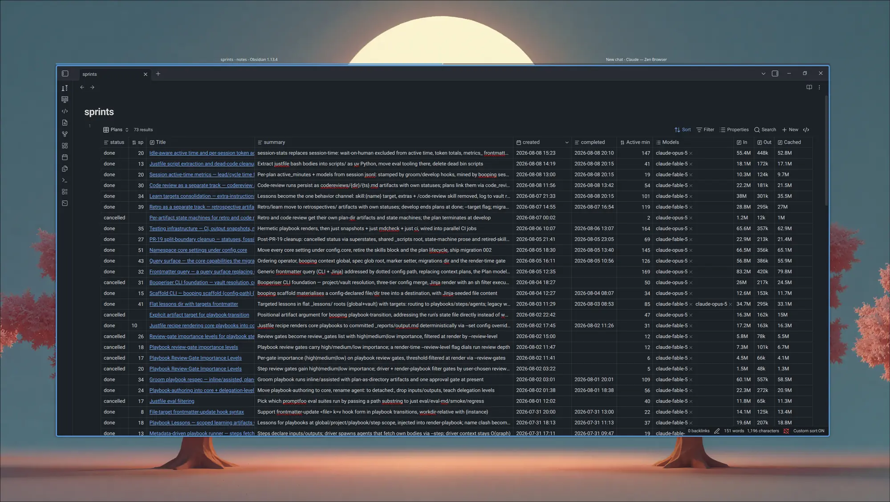

# booping

A self-learning, project-scoped sprint workflow for Claude Code. booping turns a feature idea into a durable, on-disk loop — **groom → develop → retro → learn** — that effectively utilizes sub-agents to avoid context rot, with an optional second-model cross-review of every plan. Every artifact (plans, retros, lessons, sprint snapshots) lives under `~/Claude/{project}/`, one folder per codebase, so weeks-long programs stay legible long after the session ends.



*Each project's vault is a plain Obsidian-friendly folder of markdown files.*

## Obsidian-ready by design

The vault at `~/Claude/{project}/` is markdown-only with YAML frontmatter that Obsidian renders natively as Properties. One vault per project, side-by-side with whatever else you keep in `~/Claude/`. No proprietary database, no lock-in — just files you can grep, version, and edit by hand.

## Disclaimer

booping is aimed at **experienced developers and tech leads** — people comfortable making architectural calls, decomposing work, and reviewing code critically. The skills assume you can tell a sharp plan from a vague one and a sound diff from a sloppy one.

It's built for **iterative, agile-style development**: maintenance, incremental features, or growing a project sprint by sprint. It is **not** a waterfall tool — don't hand it a whole-project spec and expect a finished product. One plan is one sprint; the loop compounds across many.

Per-project configuration tunes the framework to each codebase: place a `~/Claude/{project}/config.yaml` file in your vault and it deep-merges over the plugin's `src/config.yaml` at render time — sprint scale, task types, branch conventions and agent wiring are the natural targets for per-project tuning. No key is validated and no key is restricted to a tier, so your own playbooks' config lives there too. The `/code-review` skill is a side-route for stack-aware review of in-progress diffs against the active plan.

## Dependencies

Required: `uv` and `git`. Optional: a `core.groom_playbook.cross_review_agent` in your config, for a second-model review of every drafted plan.

```bash
# macOS
brew install uv git

# Linux (Debian/Ubuntu)
sudo apt install -y git
curl -LsSf https://astral.sh/uv/install.sh | sh
```

## Installation

Inside Claude Code, register the marketplace once, then install the plugin:

```
/plugin marketplace add A/claude-booping
/plugin install booping@booping
```

Update later via `/plugin update booping` (or from the `/plugin` UI).

After installing, `cd` into the target repo and run `/playbook setup`. It settles the machine config, then scaffolds the vault (`plans/`, `retrospectives/`, `_lessons/`, `notes/`, `_booping/`) and writes the `.booping` marker. Anything already in place is detected and skipped.

## Quick start

For a hand-holding walkthrough and per-command reference, see the [docs site](https://A.github.io/claude-booping/).

The full loop is five steps. Run them in order — grooming and development are **playbooks**, driven by `/playbook`:

```bash
# Inside the target repo, once:
/playbook setup

# Spec a feature, bug, or refactor — free-text description.
# The more detailed your brief, the sharper the resulting plan:
/playbook groom — add per-tenant rate limiting to the public API

# Execute the plan (bare invocation resolves it from the vault queue):
/playbook develop
# …or name it:
/playbook develop — plans/20260426-09-30_per-tenant-rate-limiting/index.md

# Retrospect on what shipped:
/playbook retro

# Fold the retro's findings into durable rules:
/playbook learn
```

Candidates are listed for you if you forget the exact path.

## Workflow

A plan moves through a small set of statuses. The `groom` playbook shapes the spec and waits for explicit user approval before handing off; the `develop` playbook claims the next ready plan and executes milestone by milestone; the `retro` playbook compares what shipped to the original spec; the `learn` playbook distils the retrospective into rules that bind the next sprint.

There is no single shared status table. **Each playbook declares its own vocabulary** in its `states:` block (`playbooks/<name>/playbook.yaml`) and advances the plan through it with `booping playbook-transition`. The plan's `index.md` is the run artifact, so its `status:` frontmatter is whatever the running playbook last wrote — and the four playbooks are wired so one's terminal status is the next one's entry:

```text
groom     framing → researching → drafting → cross-reviewing → presenting
          → awaiting-approval → ready-for-dev (terminal)
          (loopbacks: drafting → researching, awaiting-approval → drafting)

develop   awaiting-plan-review → ready-for-dev → in-progress
          → awaiting-retro (terminal) | fail (terminal)

retro     awaiting-retro → awaiting-learning (terminal)

learn     awaiting-learning → done (terminal)
```

`/code-review` is stateless — it reads a plan and changes no status.

## Statuses

A plan carries one of the following statuses in its frontmatter. The owning playbook is the one whose machine writes it.

**groom**

- **`framing`** — intake is clarifying the request and settling scope.
- **`researching`** — the blast-radius and web-research passes are running.
- **`drafting`** — design is being settled with you in conversation and written into the plan body.
- **`cross-reviewing`** — a second model is reviewing the draft (skipped when no reviewer is configured).
- **`presenting`** — the approval screen is on the table.
- **`awaiting-approval`** — waiting for your explicit approval or change request. This is groom's single review gate.
- **`ready-for-dev`** *(groom's terminal)* — approved. Queued for the develop playbook to claim.

**develop**

- **`awaiting-plan-review`** — develop's entry status when a run starts on a plan you have not yet approved.
- **`in-progress`** — develop has claimed the plan and is executing milestones.
- **`awaiting-retro`** *(develop's terminal)* — all milestones done and verification green.
- **`fail`** *(develop's terminal)* — an unrecoverable blocker after two documented fix attempts, with your approval to abort.

**retro / learn**

- **`awaiting-learning`** *(retro's terminal)* — the retrospective is written and signed off.
- **`done`** *(learn's terminal)* — every accepted lesson is written to its target. Also stamped `goal: skipped` by retro's `drop-plan` script when you skip a plan's retro outright.

Each playbook's `states:` block is the canonical contract for its own transitions — triggers (`when`), gates and hooks. Read it there if you need the exact rules; this README only narrates them.

## Sprints & SPs

In booping, a **plan is a sprint** — the unit the groom playbook produces and the develop playbook executes end-to-end. Story Points (SP) measure the sprint's **complexity and review burden**, not effort or time. A 20-SP sprint might take a couple of hours on one project, a full session on another, and a full day on a third; what matters is that SPs give you a feel for the size and review weight of the sprint, independent of how fast the underlying work happens.

The 1–5 scale (`src/config.yaml` `core.sprint.scale`):

- **1 SP** — Simple text/config change, no risk.
- **2 SP** — Simple task, predictable, no risk.
- **3 SP** — Medium task, minor risks but predictable overall.
- **4 SP** — Complex task, medium risk, may need small research but clear enough.
- **5 SP** — Research task — developer needs to clarify and decompose further before proceeding.

In practice, sprints over **35 SP** (`core.sprint.default_threshold_sp`) get hard to keep reviewable, so groom ends up suggesting a split into sibling sprints above that mark. It's a soft cap, **not a velocity** — booping has no fixed cadence and no per-week capacity. Tasks at 5 SP must be re-decomposed; tasks at 1 SP should be grouped into a single agent briefing.

## Extensibility

Wide-domain skills stay stack-agnostic. Project-specific concerns live entirely in your vault:

- **`~/Claude/{project}/_booping/skill_<name>.md`** — per-skill extension. Loaded automatically into the skill's context at invocation. Use it to teach groom your codebase's conventions or develop your test runner.
- **`~/Claude/{project}/_booping/agent_<name>.md`** — per-agent extension. Injected into the matching agent's body at load time so worker agents inherit project rules without separate reads.
- **`~/Claude/{project}/plan_templates/*.md`** — project-local plan templates. Discovered alongside the core templates (`backend`, `frontend`, `claude-skill`, `cli`, `documentation`); can override a core one by sharing its `name` or add entirely new ones.
- **`~/Claude/{project}/review_templates/*.md`** — project-local code-review templates. Loaded by `/code-review` alongside the core templates (`coding-architecture`, `python`, `security`); the skill picks the matching subset by inspecting the repo's manifests and reading each template's `description` frontmatter.
- **`~/Claude/{project}/_lessons/`** — targeted rules from the learn playbook. Each carries a `targets:` list naming the playbooks, steps, and agents it reaches.

## Learning

Retro and learn are the loop that makes booping worth more than the sum of its sprints.

The `retro` playbook reads the plan, mines the session logs and git diff for what actually shipped, takes your raw feedback first, and writes `retro.md` into the plan's own directory — what worked, what didn't, divergences from spec, the goal outcome.

The `learn` playbook then reviews the retrospective with the user, picks the durable findings, and routes each to exactly one target: a targeted lesson (`~/Claude/{project}/_lessons/{N}_{title}.md`, carrying a `targets:` list), extra instructions for a skill or agent (`~/Claude/{project}/_booping/skill_<name>.md`, `_booping/agent_<name>.md`), or a one-line bullet in the attached repo's `CLAUDE.md`. Lessons are injected into the playbooks, steps and agents they name; extension files travel with the matching skill or agent at load time. The user confirms the whole review table before anything lands.

## What booping doesn't do

booping is a feedback loop, not an autopilot. Three things stay your job:

- **Plan review is still on you.** Groom produces a draft and waits at `awaiting-plan-review` for a reason — sharpen it, push back, ask for splits. As lessons accumulate, plans drift toward your style and constraints, but only if you fed the loop honest reviews. Shit in, shit out.
- **Code review is still on you.** Develop ships milestones; you own the quality bar. `/code-review` is a helper that runs stack-aware passes against the in-progress diff and surfaces findings — but reading those findings, deciding what's off, and bringing the feedback into retro so learn can turn it into rules is still your job.
- **Learning isn't automatic.** Retro and learn are scaffolding for a feedback loop, not a substitute for one. You still need to sit with the retrospective, confirm which findings are durable, and let learn write them down. Skip that step and the loop stalls.

Invest in the loop and it compounds. Treat it as a magic box and you'll get magic-box results.

## License

MIT — see [LICENSE](LICENSE).
