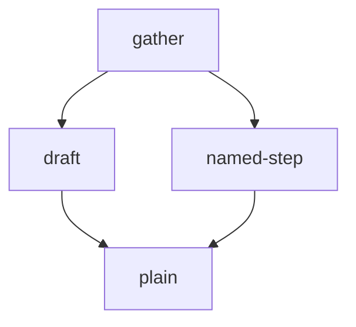

# Composed Procedure

Plain prose preamble that must pass through verbatim, including this literal
token: {{ leftover }} — no Jinja evaluation happens here.

## Execution graph

Steps on one line run in parallel — spawn all their sub-agents in one message,
wait for all to finish, then start the next wave.

1. `gather`
2. `draft` ∥ `named-step`
3. `plain`

## Gather

Instructions:
- Summary: Gather inputs.
- Run in a sub-agent — model sonnet, effort medium.

Read [Gather]({HOME}/_playbooks/composed/gather/prompt.md) for content.

## Draft

Instructions:
- Summary: Draft the artifact.
- After: gather
- Parallel with: named-step
- Run in a sub-agent — model opus, effort high.
- Review gate: stop after this step — "confirm the draft before continuing"; continue only on explicit user confirmation.

Read [Draft]({HOME}/_playbooks/composed/draft/prompt.md) for content.

## Named Step

Instructions:
- Summary: A step delegated to a named agent.
- After: gather
- Parallel with: draft
- Run in sub-agent: booping-researcher.
- Review gate: stop after this step — "sign off the research"; continue only on explicit user confirmation.

Read [Named Step]({HOME}/_playbooks/composed/named-step/prompt.md) for content.

## Plain

Instructions:
- Summary: A plain step with no agent and no gate.
- After: draft, named-step

Read [Plain]({HOME}/_playbooks/composed/plain/prompt.md) for content.
