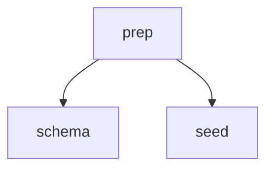

# Playbook Frontmatter Graph — Parallel Step Execution

## Context

`booping render-playbook <name>` currently composes a playbook from its manifest **body**: a Jinja template calling `{{ inline_step('x') }}` / `{{ reference_step('x') }}`, where call order defines a strictly linear sequence. There is no way to express "these steps are independent — run them in parallel".

This plan replaces body composition with a **declarative `graph:` mapping in the manifest frontmatter**. The renderer topo-sorts the graph into waves, renders wave-1 steps with bodies embedded and all later steps as `Read` links, emits a mermaid diagram + wave list as the driver contract, and surfaces every graph problem **in-band** (as notices in the rendered output the `/playbook` skill relays to the user) rather than crashing the CLI mid-skill.

The manifest body demotes to a plain-markdown preamble (playbook-level instruction), inserted verbatim above the graph. `inline_step` / `reference_step` are removed. This supersedes the body-composition model shipped earlier on this same unmerged branch (M1–M5 of the previous sprint); no legacy/back-compat path is needed.

## Decisions

- **Graph in frontmatter, not step meta and not body grammar**: single machine-readable source of truth for membership + order; whole topology visible in one YAML block; authors write zero Jinja. Rejected: `depends_on` per step file (graph invisible, two ordering sources), `parallel()` body grammar (keeps Jinja authoring bar).
- **Wave model (topo levels), not general DAG scheduling**: `level(step) = 1 + max(level(deps))`. The LLM driver spawns sub-agents in batches and waits — it schedules in waves regardless, so DAG generality is wasted. Accepted loss: a step may idle until its whole prior wave finishes even if its own deps are done.
- **Auto render mode**: wave 1 → body embedded; every later step → `Read [Title](path) for content.` link, fetched when its wave starts. The renderer decides; authors never pick a mode.
- **In-band error reporting**: graph problems render as notices inside the composed output (`**STOP — tell the user:** …` / `**Note — tell the user:** …`); exit code stays `0`. The skill relays the notice and (for STOP) refuses to execute. Rationale: the consumer is the `/playbook` skill mid-conversation — a CLI crash there is worse UX than a rendered directive.
- **Body inserted verbatim**: no Jinja rendering of the manifest body at all. Preamble prose only.
- **Parallel waves require sub-agents**: a step with `agent: null` sharing a wave with other steps is a blocking notice — conversation-inline steps cannot run concurrently.
- **Review gates fire per wave**: the skill stops after the whole wave completes and presents every member gate labeled by step name; each gate needs its own explicit confirmation before the next wave starts. Gate rendering in the step partial is unchanged.
- **Wave failure halts the run**: if any step in a wave fails (sub-agent error, unmet step contract), the skill reports the failure and does not start the next wave. Conversation-level rule — no persisted state (resume remains out of scope).
- **Parallel output interleaving is a non-issue**: sub-agents return discrete tool results to the driving conversation; there is no shared stdout to corrupt. Each briefing carries a bounded return contract (lesson 0007) so parallel results stay compact.
- **No `graph:` list shorthand**: only the mapping form in this sprint (see Out of scope).

## Architecture

- `Playbook` (pydantic, `booping-python/src/booping/context/playbook.py`) gains `graph: dict[str, list[str]]` parsed from manifest frontmatter (missing key → empty dict; compose treats empty as blocking).
- A pure resolver in `playbook.py` — `resolve_waves(graph) -> WaveResolution` — computes waves + collects problems without raising; deterministic ordering everywhere (graph key insertion order). Locked shape:

  ```python
  class GraphProblem(BaseModel):
      kind: Literal["cycle", "unknown_dep"]
      cycle: list[str] = []          # kind=cycle: the cycle path, e.g. ["a", "b", "a"]
      dep: str = ""                  # kind=unknown_dep: the missing key
      dependent: str = ""            # kind=unknown_dep: the step that listed it

  class WaveResolution(BaseModel):
      waves: list[list[str]] = []    # empty when any problem present
      problems: list[GraphProblem] = []
  ```

- `compose()` (`booping-python/src/booping/commands/render_playbook.py`) drops the `inline_step`/`reference_step` env globals; instead it validates graph membership, builds notices, and renders: notices → body verbatim → `_partials/_playbook_graph.j2` (mermaid + wave list) → per-step sections via `_partials/_playbook_step.j2` in wave order.
- Membership checks need no filesystem access in `compose()`: the loader already populates `pb.steps`. Missing step file = graph key ∉ `{s.name for s in pb.steps}`; orphan = step name ∉ graph keys.
- Locked template contexts: `_playbook_graph.j2` receives `graph: dict[str, list[str]]` and `waves: list[list[str]]`; `_playbook_step.j2` receives `step: Step`, `deps: list[str]` (graph order), `siblings: list[str]` (other members of the step's wave), `embed: bool` (true for wave 1). `resolve_agent` stays an env global.
- Consumers: the `/playbook` skill (`src/templates/skills/playbook.md.j2`) drives the rendered output — STOP notice handling, wave-batched sub-agent spawning, per-wave gates. `documentation/playbooks.md` and `CLAUDE.md` describe the authoring model.

### Rendered output contract (locked)

Section order: **notices → body preamble (verbatim) → `## Execution graph` → step sections in wave order** (within a wave: graph key insertion order).

Notices (exact templates; one line each, rendered before everything else):

- Missing step file (blocking): `**STOP — tell the user:** step '<name>' is referenced in the graph but steps/<name>.md does not exist. Do not execute this playbook.`
- Unknown dep key (blocking): `**STOP — tell the user:** '<dep>' is listed as a dependency of '<name>' but is not a step in the graph. Do not execute this playbook.`
- Cycle (blocking): `**STOP — tell the user:** the graph has a cycle: <a> → <b> → … → <a>. Do not execute this playbook.`
- No graph (blocking): `**STOP — tell the user:** playbook '<name>' has no graph: in its frontmatter. Do not execute this playbook.`
- Inline step in parallel wave (blocking): `**STOP — tell the user:** step '<name>' runs inline (agent: null) but shares a wave with other steps; inline steps cannot run in parallel. Do not execute this playbook.`
- Orphan step file (non-blocking): `**Note — tell the user:** step '<name>' exists in steps/ but is not wired into the graph; it will not run.`

Any blocking notice → step sections are omitted entirely (notices + preamble + graph section only, graph section itself skipped when unresolvable).

`## Execution graph` section:

````markdown
## Execution graph



Steps on one line run in parallel — spawn all their sub-agents in one message,
wait for all to finish, then start the next wave.

1. `prep`
2. `schema` ∥ `seed`
````

- Mermaid: always emitted; one `a --> b` line per edge in graph insertion order; a node with no edges appears as a bare node id line.
- Wave list: numbered, backticked step names, ` ∥ ` separator inside a wave.

Step sections (`_playbook_step.j2`):

- Heading `## <Title>` (title fallback: name with `-`→space, title-cased — unchanged).
- `Instructions:` bullets, in order: `- After: <dep>, <dep>` (omitted for wave 1), `- Parallel with: <sibling>, <sibling>` (only in multi-member waves), agent bullet (unchanged grammar), review-gate bullet (unchanged).
- Wave 1: full step body embedded. Later waves: `Read [<Title>](<abs path>) for content.`

## Milestones

### M1: Graph model + wave resolver — 6 SP | done

**Goal**: `Playbook` carries the frontmatter graph and a pure resolver turns it into deterministic waves + structured problems.

**Verify**: `cd /home/anton/Dev/@A/claude-booping && uv run --project booping-python pytest booping-python/tests/context/playbook_test.py -q` → all pass.

| Task | Description | Files | SP | Status |
|------|-------------|-------|----|--------|
| 1.1 | Add `graph: dict[str, list[str]]` to `Playbook`; parse from manifest frontmatter in `_load_one` (missing/None → `{}`; values coerced to `list[str]`) | `booping-python/src/booping/context/playbook.py` | 1 | done |
| 1.2 | Add `resolve_waves(graph) -> WaveResolution` per the locked shape in Architecture (`GraphProblem` + `WaveResolution` pydantic models; level = 1 + max dep level; insertion-order within wave; never raises) | `booping-python/src/booping/context/playbook.py` | 3 | done |
| 1.3 | Unit tests: linear chain, diamond, cross-wave edge (dep two waves back), cycle detection with path, unknown dep key, empty graph, deterministic ordering | `booping-python/tests/context/playbook_test.py` | 2 | done |

#### Task 1.1 DoD

- [x] Fixture manifest with `graph:` mapping loads into `Playbook.graph` verbatim (insertion order preserved).
- [x] Manifest without `graph:` loads with `graph == {}` — no warning, no crash.
- [x] `just typecheck` clean.

#### Task 1.2 DoD

- [x] Diamond graph (`a; b,c ← a; d ← b,c`) resolves to `[[a], [b, c], [d]]`.
- [x] Cross-wave edge (dep from wave 1 consumed in wave 3) resolves without error.
- [x] Cycle returns a problem carrying the cycle path; no exception.
- [x] Unknown dep key returns a problem carrying `(dep, dependent)`; no exception.

#### Task 1.3 DoD

- [x] Every resolver behavior in the 1.2 DoD has a test.
- [x] Two runs produce identical wave ordering (determinism asserted via repeated call).

---

### M2: compose() rework — graph rendering + in-band notices — 10 SP | done

**Goal**: `booping render-playbook <name>` emits the locked output contract: notices, verbatim preamble, mermaid + wave list, wave-ordered step sections with auto inline/reference mode.

**Verify**: `cd /home/anton/Dev/@A/claude-booping && uv run --project booping-python pytest booping-python/tests/test_render_playbook.py -q` → all pass; `just test` green.

| Task | Description | Files | SP | Status |
|------|-------------|-------|----|--------|
| 2.1 | Rework `compose()`: drop `inline_step`/`reference_step` globals; validate membership via loaded `pb.steps` (missing file, orphan, no-graph, inline-in-parallel-wave) + `WaveResolution.problems` into notices per the locked templates; blocking notice → omit step sections; body inserted verbatim (no Jinja render); pass the locked template contexts (`graph`/`waves` to `_playbook_graph.j2`; `step`/`deps`/`siblings`/`embed` to `_playbook_step.j2`) | `booping-python/src/booping/commands/render_playbook.py` | 3 | done |
| 2.2 | New `_playbook_graph.j2`: mermaid block (edges in insertion order, bare node ids for edge-less nodes) + parallel-execution instruction line + numbered wave list with ` ∥ ` separator | `src/templates/_partials/_playbook_graph.j2` | 2 | done |
| 2.3 | Rework `_playbook_step.j2`: `- After:` bullet (deps, graph order; omitted wave 1), `- Parallel with:` bullet (multi-member waves only), mode driven by wave index (wave 1 embed, later reference); agent + review-gate bullets unchanged | `src/templates/_partials/_playbook_step.j2` | 2 | done |
| 2.4 | Rework render-playbook tests + fixtures: `composed` fixture gets a diamond `graph:` (embedded wave 1, reference later waves, parallel wave, mermaid, wave list asserted); new fixtures/cases per notice type (missing step, orphan, cycle, no graph, inline-in-parallel); drop `uncalled.md`-style body-call cases | `booping-python/tests/test_render_playbook.py`, `booping-python/tests/__fixtures__/render-playbook-home/_playbooks/composed/playbook.md`, `booping-python/tests/__fixtures__/render-playbook-home/_playbooks/composed/steps/*.md`, new fixture dirs under `booping-python/tests/__fixtures__/render-playbook-home/_playbooks/` | 3 | done |

#### Task 2.1 DoD

- [x] Output section order matches the locked contract exactly.
- [x] Each of the six notice templates reproduced byte-exact (asserted in 2.4 tests).
- [x] Blocking notice → no step sections in output; exit code still `0`.
- [x] Body containing Jinja syntax (e.g. `{{ x }}`) passes through verbatim.

#### Task 2.2 DoD

- [x] Diamond fixture renders mermaid with every edge, insertion order.
- [x] Single-step graph renders mermaid with one bare node id, wave list `1. `step``.

#### Task 2.3 DoD

- [x] Wave-1 section: no `After`, body embedded.
- [x] Later-wave section: `After` lists deps in graph order; `Read [...](...) for content.` replaces body.
- [x] Multi-member wave sections carry `Parallel with:` naming every sibling.

#### Task 2.4 DoD

- [x] One test per notice type asserting the exact notice line.
- [x] Happy-path diamond test asserts embedded wave-1 body + reference links + `∥` wave list.
- [x] `just lint`, `just typecheck`, `just test` all green.

---

### M3: /playbook skill + docs — 5 SP | done

**Goal**: the `/playbook` skill drives wave-batched execution off the new output; user docs and CLAUDE.md describe the graph authoring model.

**Verify**: `cd /home/anton/Dev/@A/claude-booping && bin/booping render src/templates/skills/playbook.md.j2` renders cleanly and its Execute section references waves + STOP notices; `grep -c 'inline_step' CLAUDE.md documentation/playbooks.md src/templates/skills/playbook.md.j2` → 0 matches.

| Task | Description                                                                                                                                                                                                                                                                                                                                                                                                                                                                                                                                                                                                                                 | Files                                 | SP  | Status  |
| ---- | ------------------------------------------------------------------------------------------------------------------------------------------------------------------------------------------------------------------------------------------------------------------------------------------------------------------------------------------------------------------------------------------------------------------------------------------------------------------------------------------------------------------------------------------------------------------------------------------------------------------------------------------- | ------------------------------------- | --- | ------- |
| 3.1  | Rewrite Execute section: STOP notice → relay verbatim, do not execute; Note notice → relay, continue; walk the wave list — multi-member wave spawns all sub-agents in one message and waits for all; later-wave steps read their `Read` link at wave start; every sub-agent briefing appends a bounded return contract (the step's own contract if stated, else "return only artifacts written + outcome, ≤ 5 lines"); any step failure in a wave → report, do not start next wave; review gates presented after the whole wave, labeled by step, each needing explicit confirmation; announce graph (wave list) instead of "ordered steps" | `src/templates/skills/playbook.md.j2` | 2   | done |
| 3.2  | Rewrite authoring docs to the graph model: `graph:` frontmatter mapping, body-as-preamble, wave semantics, auto inline/reference, notice behavior, worked diamond example; remove all `inline_step`/`reference_step`/call-order prose                                                                                                                                                                                                                                                                                                                                                                                                       | `documentation/playbooks.md`          | 2   | done |
| 3.3  | Update CLAUDE.md: Playbooks bullet (Layout section) + `render-playbook` CLI line to the graph model; remove body-composition wording                                                                                                                                                                                                                                                                                                                                                                                                                                                                                                        | `CLAUDE.md`                           | 1   | done |

#### Task 3.1 DoD

- [x] Skill renders via `bin/booping render src/templates/skills/playbook.md.j2` without error.
- [x] Execute section states: one message per wave for sub-agent spawning; bounded return contract appended to every briefing; wave failure halts the run; gates after wave, labeled per step, each explicitly confirmed; STOP → refuse.
- [x] No reference to `inline_step`/`reference_step` or body call order remains.
- [x] Four-check information-architecture pass (lesson 0004: scoping, duplication, configurability, hierarchy) run on the rewritten skill body before saving.

#### Task 3.2 DoD

- [x] Worked example includes frontmatter graph + rendered wave list.
- [x] Notice behavior (STOP vs Note) documented from the author's perspective.
- [x] No stale body-composition instructions remain.

#### Task 3.3 DoD

- [x] Playbooks bullet + CLI section describe graph frontmatter and verbatim preamble.
- [x] `grep -n 'inline_step\|reference_step' CLAUDE.md` → no matches.

---

## I/O contract

- **Arguments / flags**: `booping render-playbook <name> [--output PATH|-]` — unchanged.
- **stdin**: none.
- **stdout**: composed markdown per the locked rendered-output contract (notices → preamble → execution graph → step sections).
- **stderr**: unchanged — unknown playbook / requires-project errors; loader warnings.
- **Exit codes**: `0` = rendered (including with STOP/Note notices); `1` = unknown playbook or `requires_project` unmet (unchanged). Graph problems never exit non-zero.

## Final Verification

- [x] `just lint && just typecheck && just test` green.
- [x] Happy-path: diamond fixture rendered via pytest matches locked contract (mermaid, `∥` wave list, embedded wave 1, reference links).
- [x] Failure-path: missing-step fixture renders STOP notice, exit 0, no step sections.
- [x] `bin/booping render src/templates/skills/playbook.md.j2` renders cleanly (skill consumes new contract).
- [x] `grep -rn 'inline_step\|reference_step' src/ CLAUDE.md documentation/ booping-python/src/` → no matches.

## Out of scope

- `graph:` list shorthand (`graph: [a, b, c]` as linear chain) — mapping form only.
- Cross-wave eager scheduling (running a step as soon as its own deps finish, ahead of its wave).
- Nested / hierarchical graphs, conditional edges, per-edge metadata.
- Cross-session resume of playbook runs (unchanged limitation).
- Eval suites under `~/Claude/_playbooks/` — vault-side, updated by the user separately.

## CLAUDE.md impact

Covered as task 3.3: **Layout → Playbooks bullet** (body is no longer a Jinja step-composition template; `graph:` frontmatter defines membership/order/parallelism; body = verbatim preamble) and **CLI → `render-playbook`** line (composed procedure = notices + preamble + execution graph + wave-ordered steps; graph problems reported in-band, exit 0).
